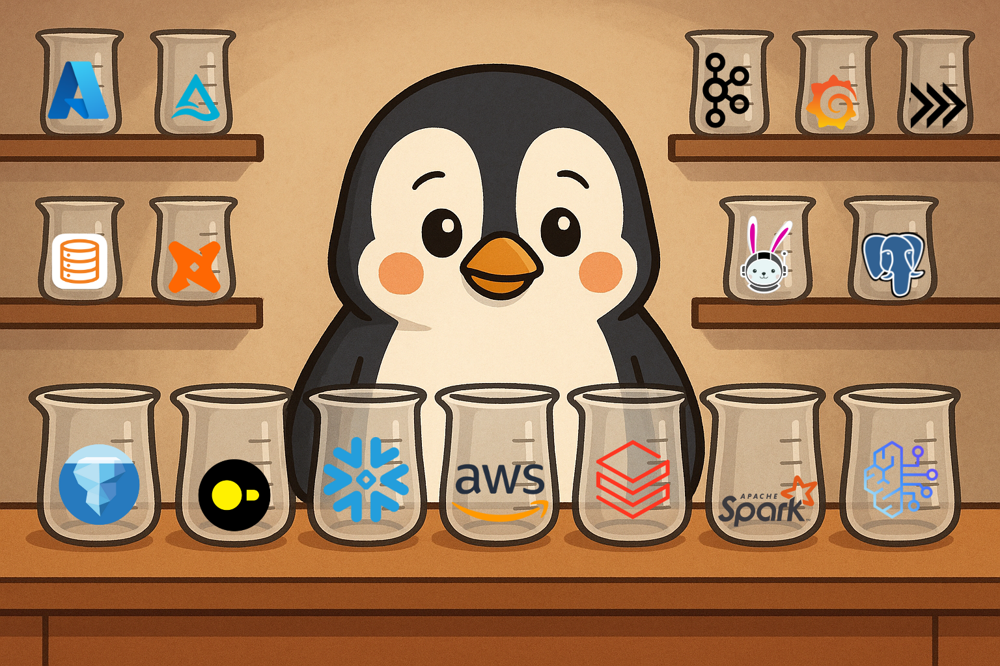

# DARE
**D**ata & **A**I **R**epository of **E**xperiments

A collection of experiments and benchmarks for modern data engineering tools, storage solutions, and AI/ML integration patterns.

## Purpose

This repository serves as a testing ground for:
- **Data Storage Solutions**: Iceberg, Delta Lake, object storage (S3, R2)
- **Query Engines**: Spark, DuckDB, Polars performance comparisons
- **Cloud Platforms**: AWS, Cloudflare R2, multi-cloud architectures
- **ETL/ELT Patterns**: Cross-language performance benchmarking
- **Data Migration**: Between different storage and catalog systems

## Articles & Experiments

| S.No. | Title | Summary |
|-------|-------|---------|
| 1 | [DARE #1: Migrating Iceberg Data from S3 to S3 Tables with EMR Spark](https://medium.com/@sanchitvj/dare-1-migrating-iceberg-data-from-s3-to-s3-tables-with-emr-spark-11677335ead6) | This article is the first of my DARE series, where I will share an experiment on how to move Apache Iceberg tables from standard S3 to S3 Tables using a Spark job in an EMR cluster. |
| 2 | [DARE #2: Cross-cloud storage adventure S3 🤝 R2](https://blog.dataengineerthings.org/dare-2-cross-cloud-storage-adventure-s3-r2-d68ed61faece) | This is the second article in my DARE series, where I will share how to move data between S3 and R2 using Spark (don’t be afraid, not EMR this time - I know the reaction when readers see “I…used EMR cluster!!… for my experiment”.) |

